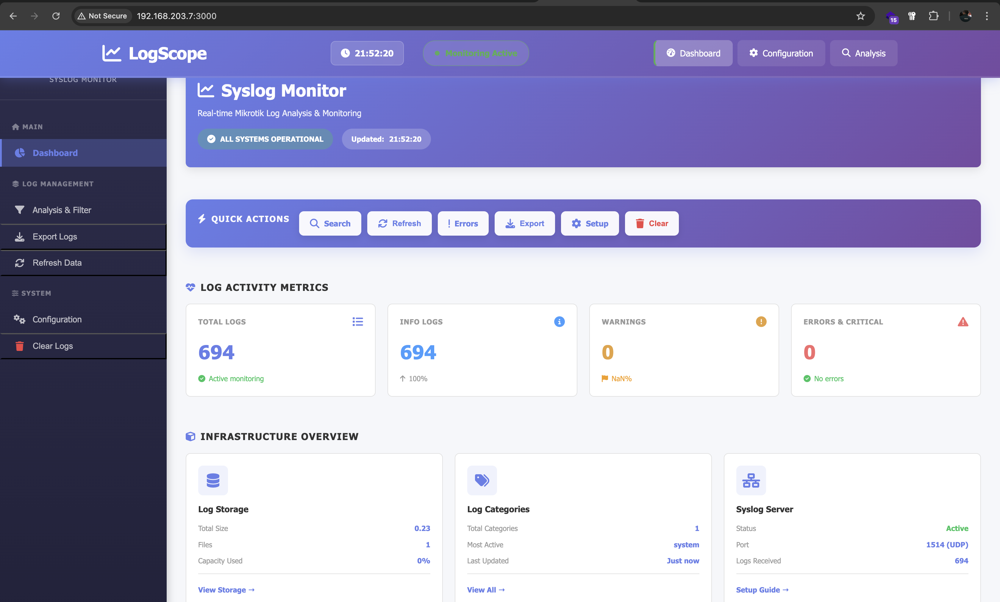

# LogScope - Mikrotik Log Analyzer

Aplikasi untuk menganalisis log Mikrotik dengan interface modern menggunakan EJS, Express, Element UI, dan Alpine.js.

## Screenshot



## Fitur

- Upload dan parse log file Mikrotik
- Analisis statistik log (errors, warnings, info)
- Filter log berdasarkan kategori dan waktu
- Dashboard interaktif dengan visualisasi data
- Real-time log monitoring

## Instalasi

```bash
npm install
```

## Menjalankan Aplikasi

Development mode:
```bash
npm run dev
```

Production mode:
```bash
npm start
```

Aplikasi akan berjalan di `http://localhost:3000`

## Teknologi

- **Backend**: Express.js
- **Template Engine**: EJS
- **UI Framework**: Element UI
- **JavaScript Framework**: Alpine.js
- **File Upload**: Multer/Express-fileupload
